# ER Diagram — Vista global (todos los microservicios)

Relaciones lógicas entre los cuatro microservicios de VetSystem.
Las líneas sólidas son FK reales dentro del mismo servicio.
Las líneas hacia `USERS` o entre servicios distintos son referencias lógicas (IDs copiados como snapshot, sin FK en base de datos).

```mermaid
erDiagram

    %% ── auth-service (VetAuth) ───────────────────────────────
    USERS {
        uniqueidentifier Id     PK
        nvarchar_256     Email  "UNIQUE"
        nvarchar_20      Role   "Admin | Veterinarian | Owner"
        bit              IsActive
        bit              IsDeleted
    }

    %% ── patients-service (VetPatients) ──────────────────────
    SPECIES {
        uniqueidentifier Id      PK
        nvarchar_100     Name
        nvarchar_10      Icon
        bit              IsActive
    }

    PATIENTS {
        uniqueidentifier Id         PK
        uniqueidentifier SpeciesId  FK
        uniqueidentifier OwnerId    "snapshot USERS.Id"
        nvarchar_200     OwnerName  "snapshot"
        nvarchar_30      OwnerPhone "snapshot"
        bit              IsDeleted
    }

    CLINICALRECORDS {
        uniqueidentifier Id              PK
        uniqueidentifier PatientId       FK
        uniqueidentifier VeterinarianId  "snapshot USERS.Id"
        datetime2        Date
    }

    CONSULTATIONLOGS {
        uniqueidentifier Id              PK
        uniqueidentifier PatientId       FK
        uniqueidentifier VeterinarianId  "snapshot USERS.Id"
        nvarchar_10      Status          "Open | Closed"
        uniqueidentifier AppointmentId   "nullable, snapshot APPOINTMENTS.Id"
    }

    VACCINEDEFINITIONS {
        uniqueidentifier Id     PK
        nvarchar_20      Scheme "SingleDose | MultiDose | Annual"
        bit              IsActive
    }

    VACCINEDOSESTEPS {
        int              Id                  PK
        uniqueidentifier VaccineDefinitionId FK
        int              DoseNumber
        int              DaysAfterPrevious
    }

    VACCINATIONRECORDS {
        uniqueidentifier Id                  PK
        uniqueidentifier PatientId           FK
        uniqueidentifier VaccineDefinitionId FK
        uniqueidentifier OwnerId             "snapshot USERS.Id"
        uniqueidentifier AdministeredById    "snapshot USERS.Id"
        datetime2        NextDueDate         "nullable"
        datetime2        Reminder7SentAt     "nullable"
        datetime2        Reminder2SentAt     "nullable"
    }

    %% ── appointments-service (VetAppointments) ───────────────
    APPOINTMENTS {
        uniqueidentifier Id              PK
        uniqueidentifier PatientId       "snapshot PATIENTS.Id"
        uniqueidentifier OwnerId         "snapshot USERS.Id"
        uniqueidentifier VeterinarianId  "snapshot USERS.Id"
        nvarchar_20      Status          "Scheduled | Completed | Cancelled | NoShow"
        bit              ReminderSent
    }

    CLINICSETTINGS {
        int      Id        PK "singleton"
        nvarchar StartTime
        nvarchar EndTime
        nvarchar WorkDays
    }

    VETERINARIANSCHEDULES {
        uniqueidentifier Id             PK
        uniqueidentifier VeterinarianId "snapshot USERS.Id"
        nvarchar_10      DayOfWeek
        nvarchar         StartTime
        nvarchar         EndTime
    }

    VETERINARIANLEAVES {
        uniqueidentifier Id             PK
        uniqueidentifier VeterinarianId "snapshot USERS.Id"
        datetime2        DateFrom
        datetime2        DateTo
        nvarchar         StartTime      "nullable"
        nvarchar         EndTime        "nullable"
    }

    %% ── notifications-service (VetNotifications) ─────────────
    NOTIFICATIONS {
        uniqueidentifier Id        PK
        nvarchar         Type      "WhatsApp | Email"
        nvarchar_450     Status    "Pending | Sent | Failed"
        datetime2        SentAt    "nullable"
    }

    REMINDERS {
        uniqueidentifier Id              PK
        uniqueidentifier AppointmentId   "snapshot APPOINTMENTS.Id"
        nvarchar_20      OwnerPhone      "snapshot"
        nvarchar_256     OwnerEmail      "nullable, snapshot"
        datetime2        ScheduledSendAt
        bit              Sent
    }

    %% ── FK reales (mismo servicio) ───────────────────────────
    SPECIES            ||--o{ PATIENTS           : "clasifica"
    PATIENTS           ||--o{ CLINICALRECORDS    : "tiene"
    PATIENTS           ||--o{ CONSULTATIONLOGS   : "tiene"
    PATIENTS           ||--o{ VACCINATIONRECORDS : "recibe"
    VACCINEDEFINITIONS ||--o{ VACCINEDOSESTEPS   : "define pasos"
    VACCINEDEFINITIONS ||--o{ VACCINATIONRECORDS : "cataloga"

    %% ── Referencias lógicas cross-service (snapshot) ─────────
    USERS              ||--o{ PATIENTS             : "es propietario de"
    USERS              ||--o{ CLINICALRECORDS       : "atiende como vet"
    USERS              ||--o{ CONSULTATIONLOGS      : "abre como vet"
    USERS              ||--o{ VACCINATIONRECORDS    : "aplica como vet"
    USERS              ||--o{ APPOINTMENTS          : "es vet / owner"
    USERS              ||--o{ VETERINARIANSCHEDULES : "tiene horario"
    USERS              ||--o{ VETERINARIANLEAVES    : "tiene ausencias"
    PATIENTS           ||--o{ APPOINTMENTS          : "es atendido en"
    APPOINTMENTS       ||--o{ REMINDERS             : "genera recordatorio"
    CONSULTATIONLOGS   }o--o| APPOINTMENTS          : "puede vincularse a"
```

