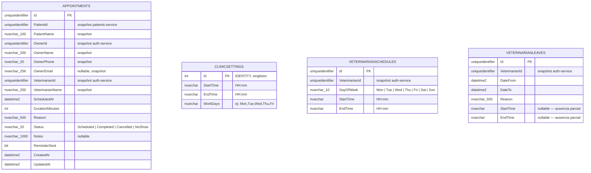

# ER Diagram — VetAppointments

Base de datos del **appointments-service**. Cubre citas, horario global de la clínica, horarios personalizados por veterinario y ausencias.

> Las tablas `ClinicSettings`, `VeterinarianSchedules` y `VeterinarianLeaves` no tienen FK entre sí ni con `Appointments`.
> La disponibilidad se calcula cruzando las tres en tiempo real dentro del servicio.
