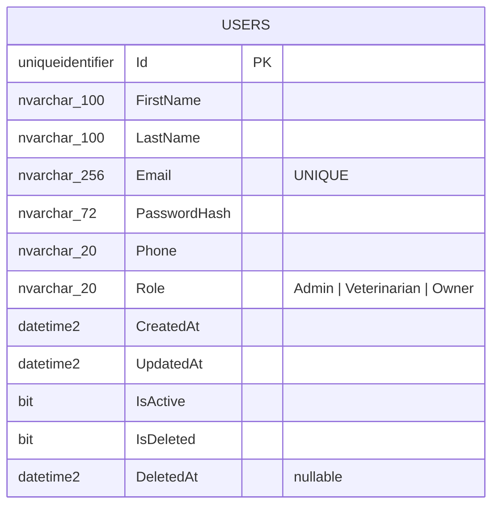

# ER Diagram — VetAuth

Base de datos del **auth-service**. Gestiona usuarios, credenciales y roles.

```mermaid
erDiagram

    USERS {
        uniqueidentifier Id           PK
        nvarchar_100     FirstName
        nvarchar_100     LastName
        nvarchar_256     Email        "UNIQUE"
        nvarchar_72      PasswordHash
        nvarchar_20      Phone
        nvarchar_20      Role         "Admin | Veterinarian | Owner"
        datetime2        CreatedAt
        datetime2        UpdatedAt
        bit              IsActive
        bit              IsDeleted
        datetime2        DeletedAt    "nullable"
    }
```
