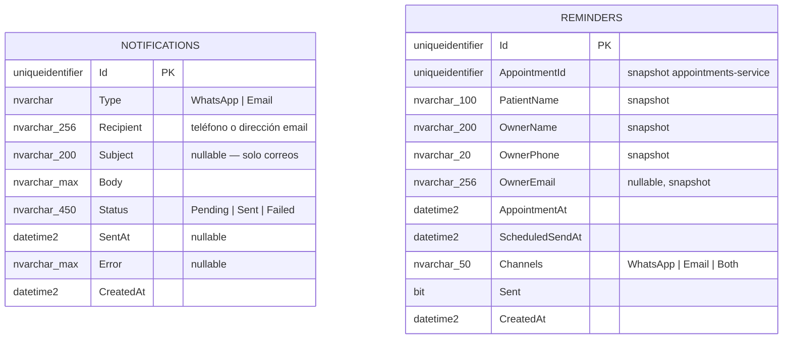

# ER Diagram — VetNotifications

Base de datos del **notifications-service**. Registra todos los envíos realizados y la cola de recordatorios de citas.

> `Notifications` y `Reminders` no tienen FK entre sí.
> Los recordatorios de vacunación se procesan directamente desde el `VaccinationReminderWorker`
> en patients-service y no pasan por esta base de datos.
