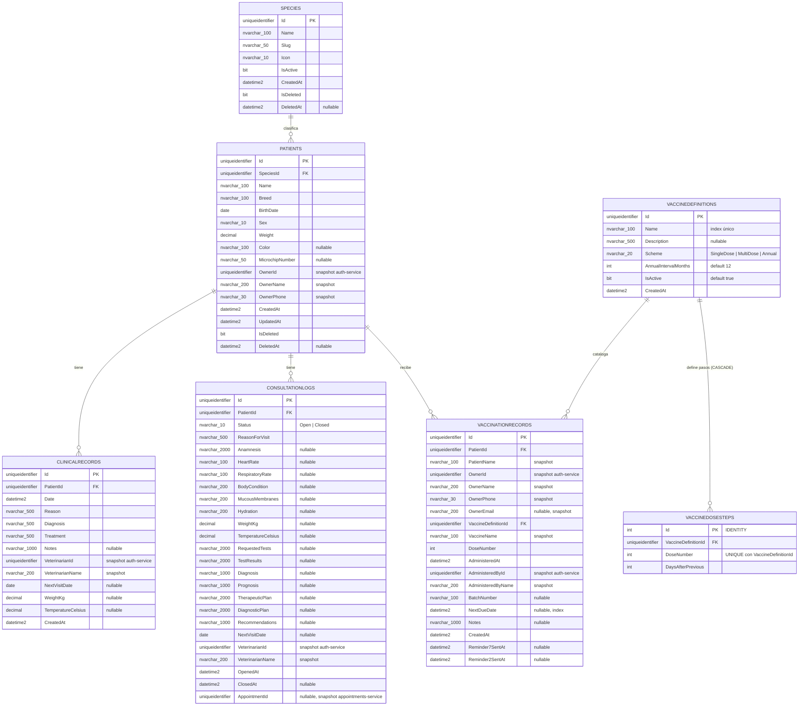

# ER Diagram — VetPatients

Base de datos del **patients-service**. Cubre pacientes, historia clínica y control de vacunación.

```mermaid
erDiagram

    SPECIES {
        uniqueidentifier Id         PK
        nvarchar_100     Name
        nvarchar_50      Slug
        nvarchar_10      Icon
        bit              IsActive
        datetime2        CreatedAt
        bit              IsDeleted
        datetime2        DeletedAt  "nullable"
    }

    PATIENTS {
        uniqueidentifier Id               PK
        uniqueidentifier SpeciesId        FK
        nvarchar_100     Name
        nvarchar_100     Breed
        date             BirthDate
        nvarchar_10      Sex
        decimal          Weight
        nvarchar_100     Color            "nullable"
        nvarchar_50      MicrochipNumber  "nullable"
        uniqueidentifier OwnerId          "snapshot auth-service"
        nvarchar_200     OwnerName        "snapshot"
        nvarchar_30      OwnerPhone       "snapshot"
        datetime2        CreatedAt
        datetime2        UpdatedAt
        bit              IsDeleted
        datetime2        DeletedAt        "nullable"
    }

    CLINICALRECORDS {
        uniqueidentifier Id                 PK
        uniqueidentifier PatientId          FK
        datetime2        Date
        nvarchar_500     Reason
        nvarchar_500     Diagnosis
        nvarchar_500     Treatment
        nvarchar_1000    Notes              "nullable"
        uniqueidentifier VeterinarianId     "snapshot auth-service"
        nvarchar_200     VeterinarianName   "snapshot"
        date             NextVisitDate      "nullable"
        decimal          WeightKg           "nullable"
        decimal          TemperatureCelsius "nullable"
        datetime2        CreatedAt
    }

    CONSULTATIONLOGS {
        uniqueidentifier Id                  PK
        uniqueidentifier PatientId           FK
        nvarchar_10      Status              "Open | Closed"
        nvarchar_500     ReasonForVisit
        nvarchar_2000    Anamnesis           "nullable"
        nvarchar_100     HeartRate           "nullable"
        nvarchar_100     RespiratoryRate     "nullable"
        nvarchar_200     BodyCondition       "nullable"
        nvarchar_200     MucousMembranes     "nullable"
        nvarchar_200     Hydration           "nullable"
        decimal          WeightKg            "nullable"
        decimal          TemperatureCelsius  "nullable"
        nvarchar_2000    RequestedTests      "nullable"
        nvarchar_2000    TestResults         "nullable"
        nvarchar_1000    Diagnosis           "nullable"
        nvarchar_1000    Prognosis           "nullable"
        nvarchar_2000    TherapeuticPlan     "nullable"
        nvarchar_2000    DiagnosticPlan      "nullable"
        nvarchar_1000    Recommendations     "nullable"
        date             NextVisitDate       "nullable"
        uniqueidentifier VeterinarianId      "snapshot auth-service"
        nvarchar_200     VeterinarianName    "snapshot"
        datetime2        OpenedAt
        datetime2        ClosedAt            "nullable"
        uniqueidentifier AppointmentId       "nullable, snapshot appointments-service"
    }

    VACCINEDEFINITIONS {
        uniqueidentifier Id                   PK
        nvarchar_100     Name                 "index único"
        nvarchar_500     Description          "nullable"
        nvarchar_20      Scheme               "SingleDose | MultiDose | Annual"
        int              AnnualIntervalMonths "default 12"
        bit              IsActive             "default true"
        datetime2        CreatedAt
    }

    VACCINEDOSESTEPS {
        int              Id                   PK "IDENTITY"
        uniqueidentifier VaccineDefinitionId  FK
        int              DoseNumber           "UNIQUE con VaccineDefinitionId"
        int              DaysAfterPrevious
    }

    VACCINATIONRECORDS {
        uniqueidentifier Id                   PK
        uniqueidentifier PatientId            FK
        nvarchar_100     PatientName          "snapshot"
        uniqueidentifier OwnerId              "snapshot auth-service"
        nvarchar_200     OwnerName            "snapshot"
        nvarchar_30      OwnerPhone           "snapshot"
        nvarchar_200     OwnerEmail           "nullable, snapshot"
        uniqueidentifier VaccineDefinitionId  FK
        nvarchar_100     VaccineName          "snapshot"
        int              DoseNumber
        datetime2        AdministeredAt
        uniqueidentifier AdministeredById     "snapshot auth-service"
        nvarchar_200     AdministeredByName   "snapshot"
        nvarchar_100     BatchNumber          "nullable"
        datetime2        NextDueDate          "nullable, index"
        nvarchar_1000    Notes                "nullable"
        datetime2        CreatedAt
        datetime2        Reminder7SentAt      "nullable"
        datetime2        Reminder2SentAt      "nullable"
    }

    SPECIES            ||--o{ PATIENTS           : "clasifica"
    PATIENTS           ||--o{ CLINICALRECORDS     : "tiene"
    PATIENTS           ||--o{ CONSULTATIONLOGS    : "tiene"
    PATIENTS           ||--o{ VACCINATIONRECORDS  : "recibe"
    VACCINEDEFINITIONS ||--o{ VACCINEDOSESTEPS    : "define pasos (CASCADE)"
    VACCINEDEFINITIONS ||--o{ VACCINATIONRECORDS  : "cataloga"
```
